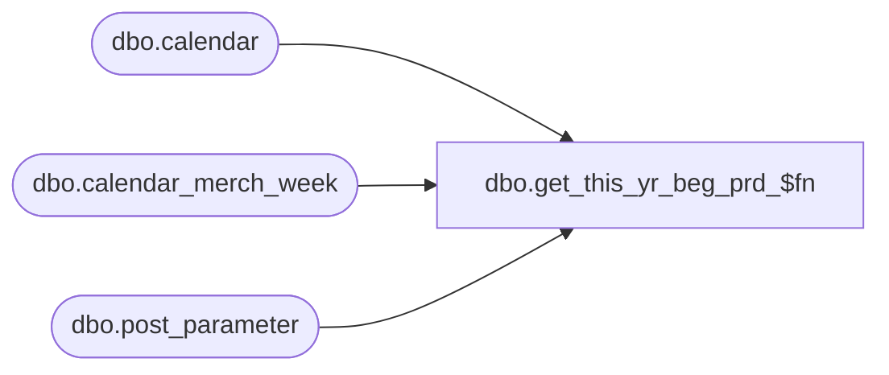

# dbo.get_this_yr_beg_prd_$fn

**Database:** ma_01  
**Server:** bedrockdb02  

## Architecture Diagram



## Table Dependencies

| Referenced Table |
|---|
| dbo.calendar |
| dbo.calendar_merch_week |
| dbo.post_parameter |

## Stored Procedure Code

```sql

```

