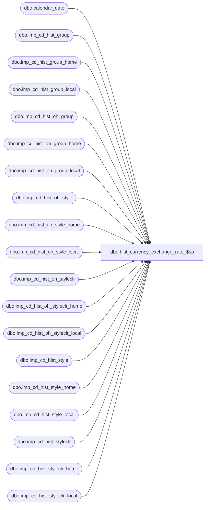

# dbo.hist_currency_exchange_rate_$sp

**Database:** ma_01  
**Server:** bedrockdb02  

## Architecture Diagram



## Table Dependencies

| Referenced Table |
|---|
| dbo.calendar_date |
| dbo.imp_cd_hist_group |
| dbo.imp_cd_hist_group_home |
| dbo.imp_cd_hist_group_local |
| dbo.imp_cd_hist_oh_group |
| dbo.imp_cd_hist_oh_group_home |
| dbo.imp_cd_hist_oh_group_local |
| dbo.imp_cd_hist_oh_style |
| dbo.imp_cd_hist_oh_style_home |
| dbo.imp_cd_hist_oh_style_local |
| dbo.imp_cd_hist_oh_styleclr |
| dbo.imp_cd_hist_oh_styleclr_home |
| dbo.imp_cd_hist_oh_styleclr_local |
| dbo.imp_cd_hist_style |
| dbo.imp_cd_hist_style_home |
| dbo.imp_cd_hist_style_local |
| dbo.imp_cd_hist_styleclr |
| dbo.imp_cd_hist_styleclr_home |
| dbo.imp_cd_hist_styleclr_local |

## Stored Procedure Code

```sql

```

