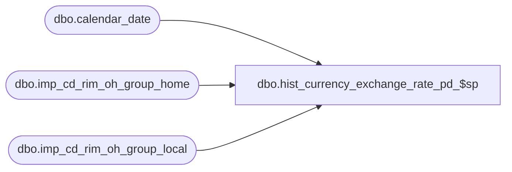

# dbo.hist_currency_exchange_rate_pd_$sp

**Database:** ma_01  
**Server:** bedrockdb02  

## Architecture Diagram



## Table Dependencies

| Referenced Table |
|---|
| dbo.calendar_date |
| dbo.imp_cd_rim_oh_group_home |
| dbo.imp_cd_rim_oh_group_local |

## Stored Procedure Code

```sql

```

