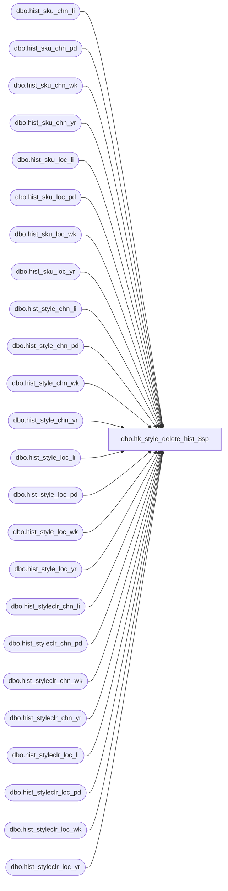

# dbo.hk_style_delete_hist_$sp

**Database:** ma_01  
**Server:** bedrockdb02  

## Architecture Diagram



## Table Dependencies

| Referenced Table |
|---|
| dbo.hist_sku_chn_li |
| dbo.hist_sku_chn_pd |
| dbo.hist_sku_chn_wk |
| dbo.hist_sku_chn_yr |
| dbo.hist_sku_loc_li |
| dbo.hist_sku_loc_pd |
| dbo.hist_sku_loc_wk |
| dbo.hist_sku_loc_yr |
| dbo.hist_style_chn_li |
| dbo.hist_style_chn_pd |
| dbo.hist_style_chn_wk |
| dbo.hist_style_chn_yr |
| dbo.hist_style_loc_li |
| dbo.hist_style_loc_pd |
| dbo.hist_style_loc_wk |
| dbo.hist_style_loc_yr |
| dbo.hist_styleclr_chn_li |
| dbo.hist_styleclr_chn_pd |
| dbo.hist_styleclr_chn_wk |
| dbo.hist_styleclr_chn_yr |
| dbo.hist_styleclr_loc_li |
| dbo.hist_styleclr_loc_pd |
| dbo.hist_styleclr_loc_wk |
| dbo.hist_styleclr_loc_yr |

## Stored Procedure Code

```sql

```

