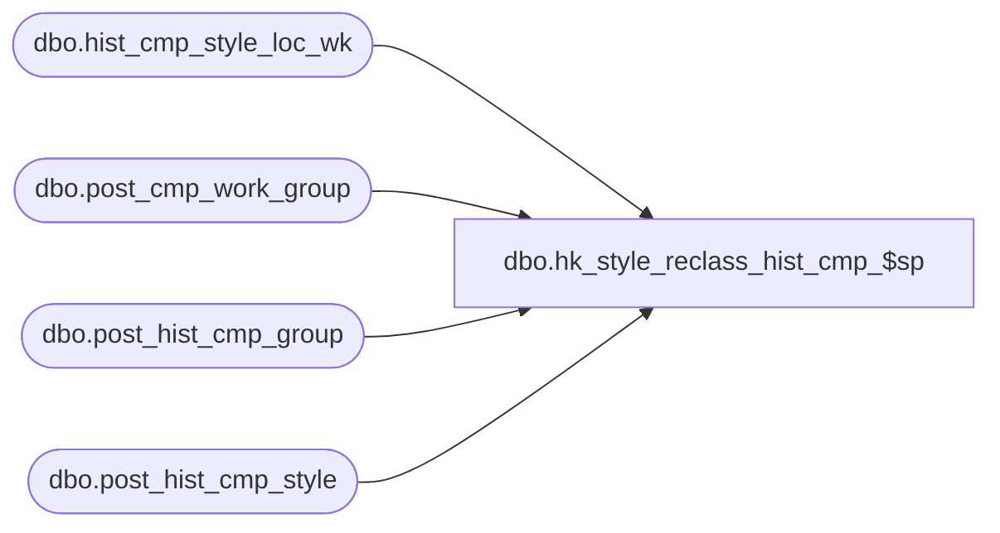

# dbo.hk_style_reclass_hist_cmp_$sp

**Database:** ma_01  
**Server:** bedrockdb02  

## Architecture Diagram



## Table Dependencies

| Referenced Table |
|---|
| dbo.hist_cmp_style_loc_wk |
| dbo.post_cmp_work_group |
| dbo.post_hist_cmp_group |
| dbo.post_hist_cmp_style |

## Stored Procedure Code

```sql

```

