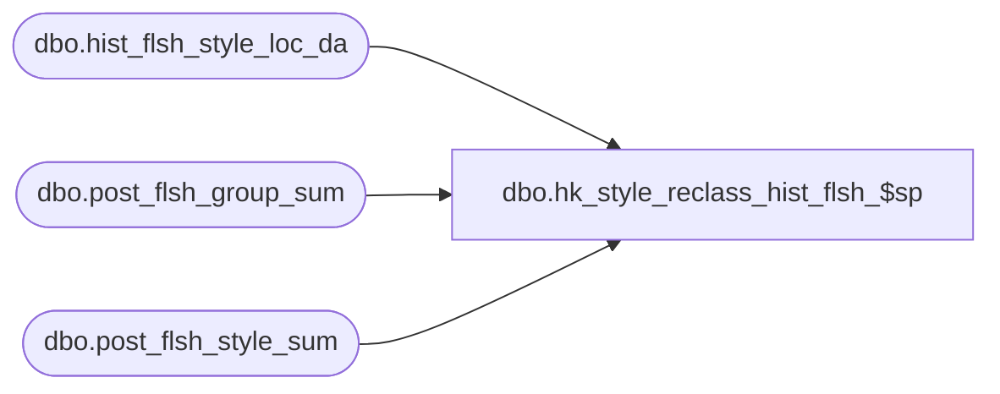

# dbo.hk_style_reclass_hist_flsh_$sp

**Database:** ma_01  
**Server:** bedrockdb02  

## Architecture Diagram



## Table Dependencies

| Referenced Table |
|---|
| dbo.hist_flsh_style_loc_da |
| dbo.post_flsh_group_sum |
| dbo.post_flsh_style_sum |

## Stored Procedure Code

```sql

```

