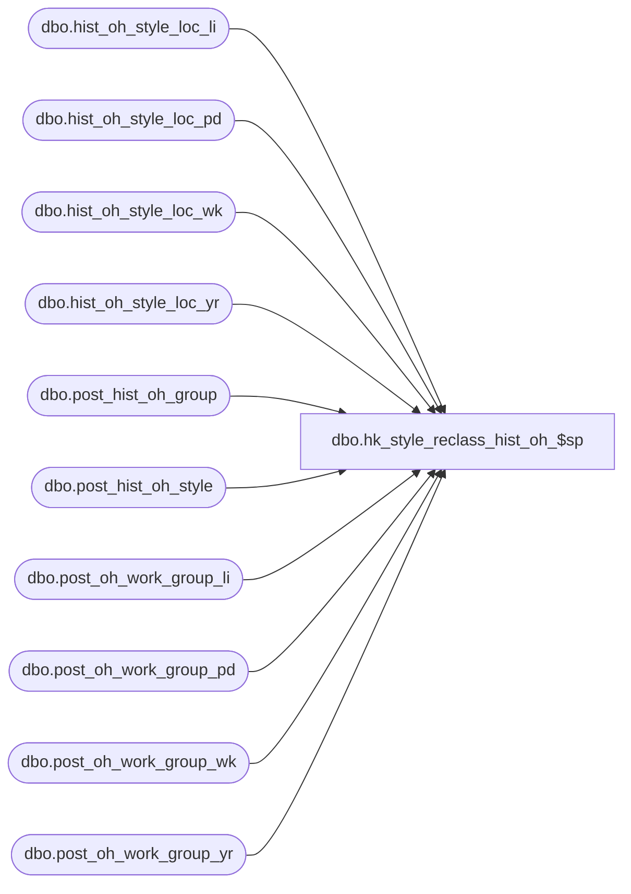

# dbo.hk_style_reclass_hist_oh_$sp

**Database:** ma_01  
**Server:** bedrockdb02  

## Architecture Diagram



## Table Dependencies

| Referenced Table |
|---|
| dbo.hist_oh_style_loc_li |
| dbo.hist_oh_style_loc_pd |
| dbo.hist_oh_style_loc_wk |
| dbo.hist_oh_style_loc_yr |
| dbo.post_hist_oh_group |
| dbo.post_hist_oh_style |
| dbo.post_oh_work_group_li |
| dbo.post_oh_work_group_pd |
| dbo.post_oh_work_group_wk |
| dbo.post_oh_work_group_yr |

## Stored Procedure Code

```sql

```

