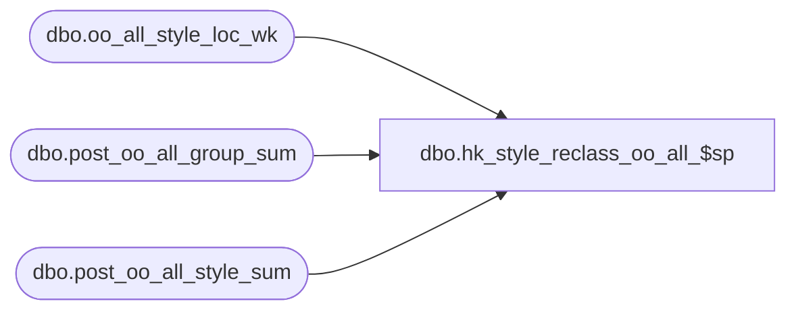

# dbo.hk_style_reclass_oo_all_$sp

**Database:** ma_01  
**Server:** bedrockdb02  

## Architecture Diagram



## Table Dependencies

| Referenced Table |
|---|
| dbo.oo_all_style_loc_wk |
| dbo.post_oo_all_group_sum |
| dbo.post_oo_all_style_sum |

## Stored Procedure Code

```sql

```

