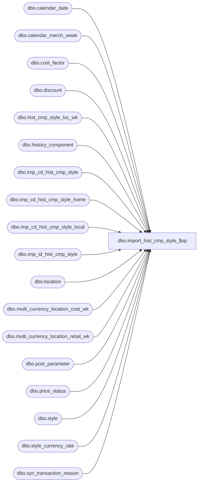

# dbo.import_hist_cmp_style_$sp

**Database:** ma_01  
**Server:** bedrockdb02  

## Architecture Diagram



## Table Dependencies

| Referenced Table |
|---|
| dbo.calendar_date |
| dbo.calendar_merch_week |
| dbo.cost_factor |
| dbo.discount |
| dbo.hist_cmp_style_loc_wk |
| dbo.history_component |
| dbo.imp_cd_hist_cmp_style |
| dbo.imp_cd_hist_cmp_style_home |
| dbo.imp_cd_hist_cmp_style_local |
| dbo.imp_id_hist_cmp_style |
| dbo.location |
| dbo.multi_currency_location_cost_wk |
| dbo.multi_currency_location_retail_wk |
| dbo.post_parameter |
| dbo.price_status |
| dbo.style |
| dbo.style_currency_rate |
| dbo.syn_transaction_reason |

## Stored Procedure Code

```sql

```

