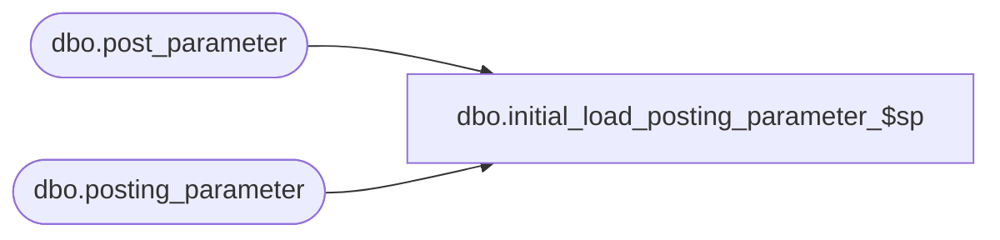

# dbo.initial_load_posting_parameter_$sp

**Database:** ma_01  
**Server:** bedrockdb02  

## Architecture Diagram



## Table Dependencies

| Referenced Table |
|---|
| dbo.post_parameter |
| dbo.posting_parameter |

## Stored Procedure Code

```sql

```

