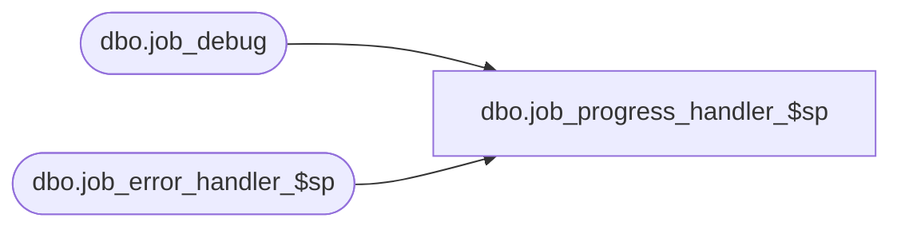

# dbo.job_progress_handler_$sp

**Database:** ma_01  
**Server:** bedrockdb02  

## Architecture Diagram



## Table Dependencies

| Referenced Table |
|---|
| dbo.job_debug |
| dbo.job_error_handler_$sp |

## Stored Procedure Code

```sql

```

