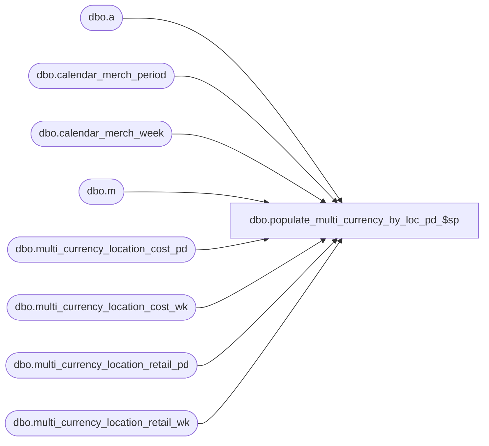

# dbo.populate_multi_currency_by_loc_pd_$sp

**Database:** ma_01  
**Server:** bedrockdb02  

## Architecture Diagram



## Table Dependencies

| Referenced Table |
|---|
| dbo.a |
| dbo.calendar_merch_period |
| dbo.calendar_merch_week |
| dbo.m |
| dbo.multi_currency_location_cost_pd |
| dbo.multi_currency_location_cost_wk |
| dbo.multi_currency_location_retail_pd |
| dbo.multi_currency_location_retail_wk |

## Stored Procedure Code

```sql

```

