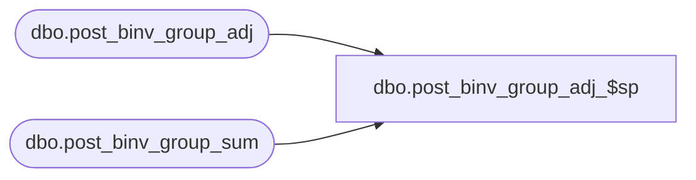

# dbo.post_binv_group_adj_$sp

**Database:** ma_01  
**Server:** bedrockdb02  

## Architecture Diagram



## Table Dependencies

| Referenced Table |
|---|
| dbo.post_binv_group_adj |
| dbo.post_binv_group_sum |

## Stored Procedure Code

```sql
CREATE proc [dbo].[post_binv_group_adj_$sp]
```

