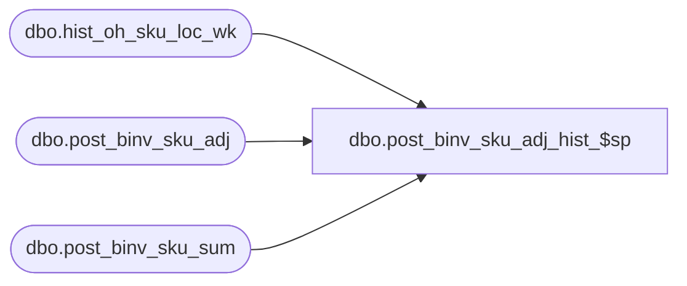

# dbo.post_binv_sku_adj_hist_$sp

**Database:** ma_01  
**Server:** bedrockdb02  

## Architecture Diagram



## Table Dependencies

| Referenced Table |
|---|
| dbo.hist_oh_sku_loc_wk |
| dbo.post_binv_sku_adj |
| dbo.post_binv_sku_sum |

## Stored Procedure Code

```sql

```

