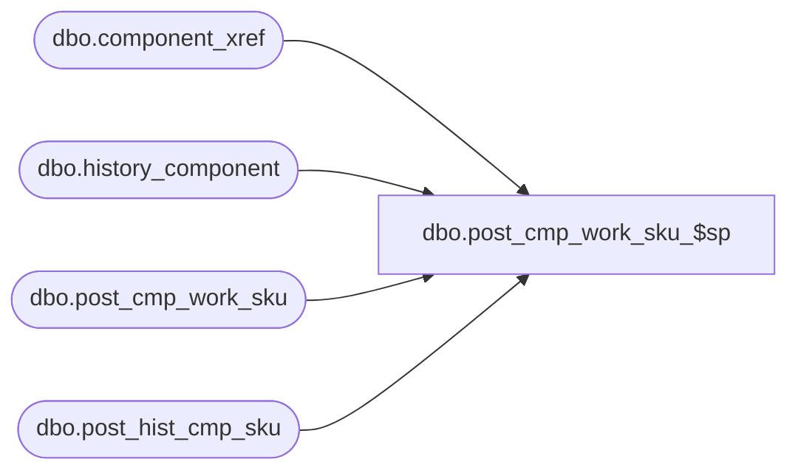

# dbo.post_cmp_work_sku_$sp

**Database:** ma_01  
**Server:** bedrockdb02  

## Architecture Diagram



## Table Dependencies

| Referenced Table |
|---|
| dbo.component_xref |
| dbo.history_component |
| dbo.post_cmp_work_sku |
| dbo.post_hist_cmp_sku |

## Stored Procedure Code

```sql

```

