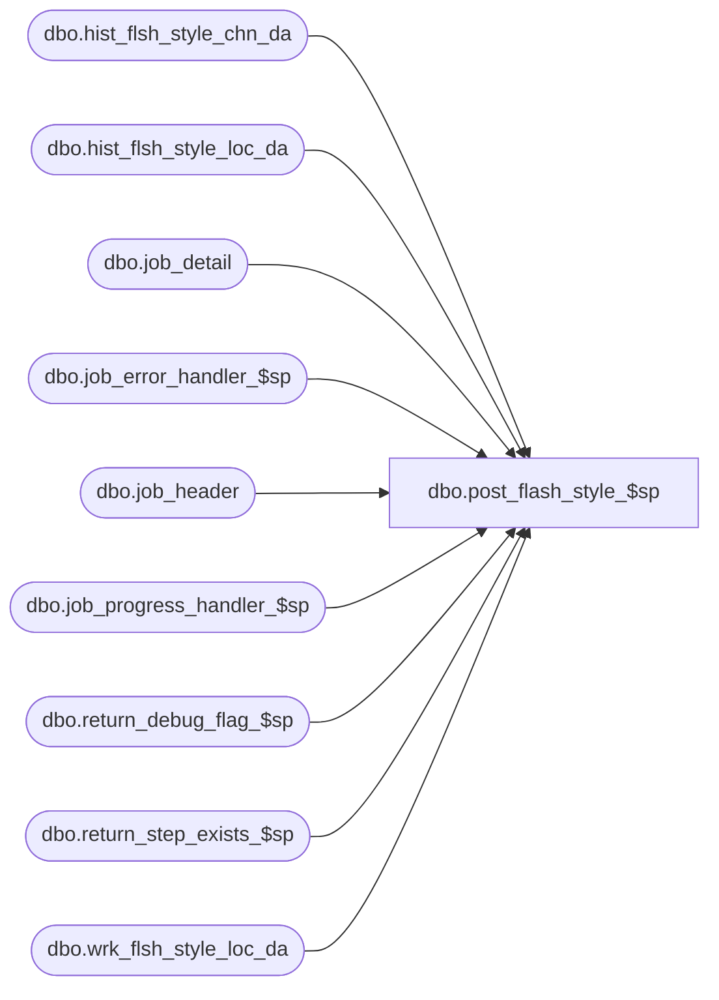

# dbo.post_flash_style_$sp

**Database:** ma_01  
**Server:** bedrockdb02  

## Architecture Diagram



## Table Dependencies

| Referenced Table |
|---|
| dbo.hist_flsh_style_chn_da |
| dbo.hist_flsh_style_loc_da |
| dbo.job_detail |
| dbo.job_error_handler_$sp |
| dbo.job_header |
| dbo.job_progress_handler_$sp |
| dbo.return_debug_flag_$sp |
| dbo.return_step_exists_$sp |
| dbo.wrk_flsh_style_loc_da |

## Stored Procedure Code

```sql

```

