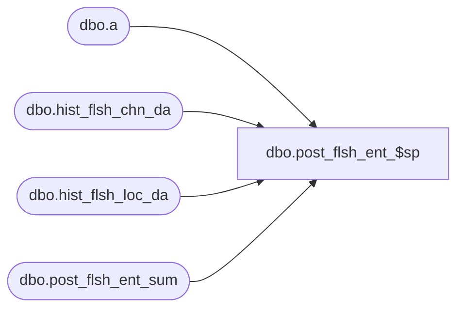

# dbo.post_flsh_ent_$sp

**Database:** ma_01  
**Server:** bedrockdb02  

## Architecture Diagram



## Table Dependencies

| Referenced Table |
|---|
| dbo.a |
| dbo.hist_flsh_chn_da |
| dbo.hist_flsh_loc_da |
| dbo.post_flsh_ent_sum |

## Stored Procedure Code

```sql

```

