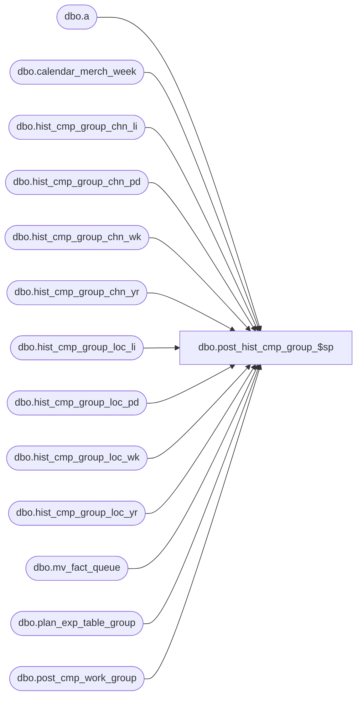

# dbo.post_hist_cmp_group_$sp

**Database:** ma_01  
**Server:** bedrockdb02  

## Architecture Diagram



## Table Dependencies

| Referenced Table |
|---|
| dbo.a |
| dbo.calendar_merch_week |
| dbo.hist_cmp_group_chn_li |
| dbo.hist_cmp_group_chn_pd |
| dbo.hist_cmp_group_chn_wk |
| dbo.hist_cmp_group_chn_yr |
| dbo.hist_cmp_group_loc_li |
| dbo.hist_cmp_group_loc_pd |
| dbo.hist_cmp_group_loc_wk |
| dbo.hist_cmp_group_loc_yr |
| dbo.mv_fact_queue |
| dbo.plan_exp_table_group |
| dbo.post_cmp_work_group |

## Stored Procedure Code

```sql

```

