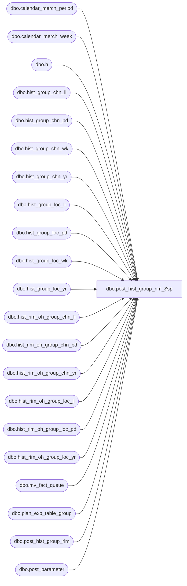

# dbo.post_hist_group_rim_$sp

**Database:** ma_01  
**Server:** bedrockdb02  

## Architecture Diagram



## Table Dependencies

| Referenced Table |
|---|
| dbo.calendar_merch_period |
| dbo.calendar_merch_week |
| dbo.h |
| dbo.hist_group_chn_li |
| dbo.hist_group_chn_pd |
| dbo.hist_group_chn_wk |
| dbo.hist_group_chn_yr |
| dbo.hist_group_loc_li |
| dbo.hist_group_loc_pd |
| dbo.hist_group_loc_wk |
| dbo.hist_group_loc_yr |
| dbo.hist_rim_oh_group_chn_li |
| dbo.hist_rim_oh_group_chn_pd |
| dbo.hist_rim_oh_group_chn_yr |
| dbo.hist_rim_oh_group_loc_li |
| dbo.hist_rim_oh_group_loc_pd |
| dbo.hist_rim_oh_group_loc_yr |
| dbo.mv_fact_queue |
| dbo.plan_exp_table_group |
| dbo.post_hist_group_rim |
| dbo.post_parameter |

## Stored Procedure Code

```sql
CREATE proc [dbo].[post_hist_group_rim_$sp]
```

