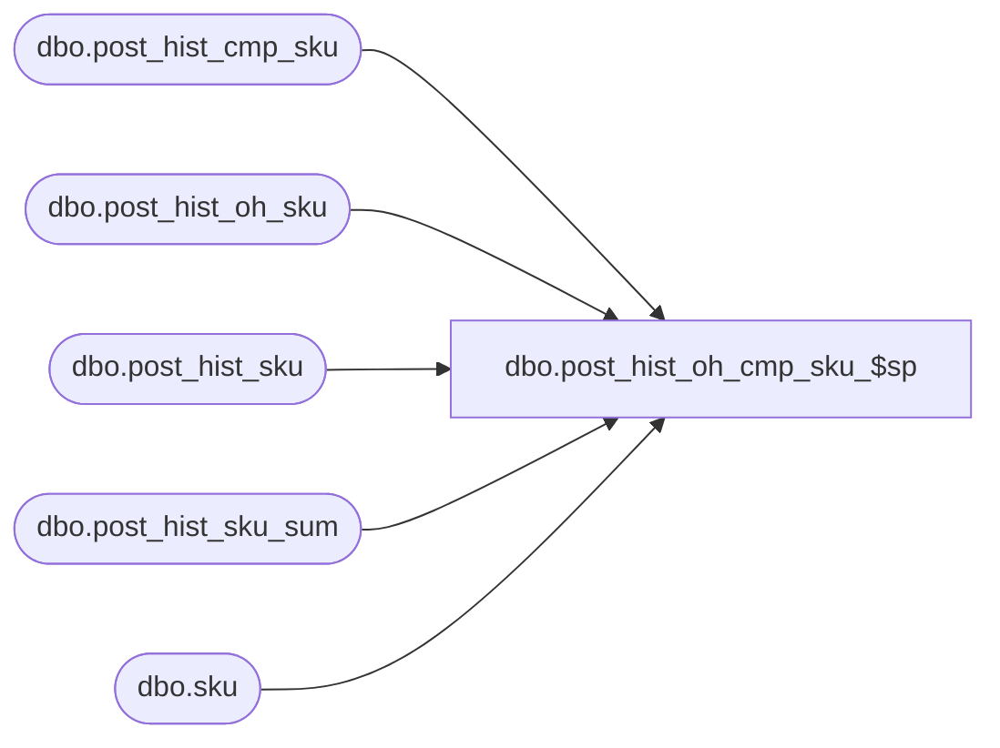

# dbo.post_hist_oh_cmp_sku_$sp

**Database:** ma_01  
**Server:** bedrockdb02  

## Architecture Diagram



## Table Dependencies

| Referenced Table |
|---|
| dbo.post_hist_cmp_sku |
| dbo.post_hist_oh_sku |
| dbo.post_hist_sku |
| dbo.post_hist_sku_sum |
| dbo.sku |

## Stored Procedure Code

```sql

```

