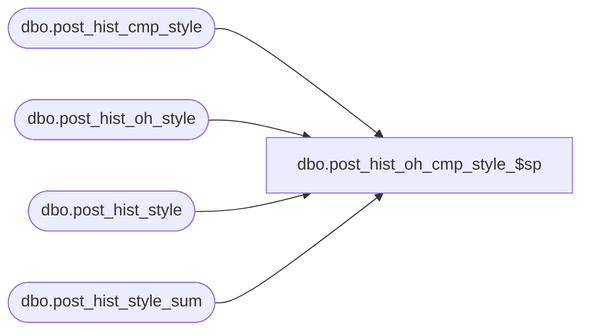

# dbo.post_hist_oh_cmp_style_$sp

**Database:** ma_01  
**Server:** bedrockdb02  

## Architecture Diagram



## Table Dependencies

| Referenced Table |
|---|
| dbo.post_hist_cmp_style |
| dbo.post_hist_oh_style |
| dbo.post_hist_style |
| dbo.post_hist_style_sum |

## Stored Procedure Code

```sql

```

