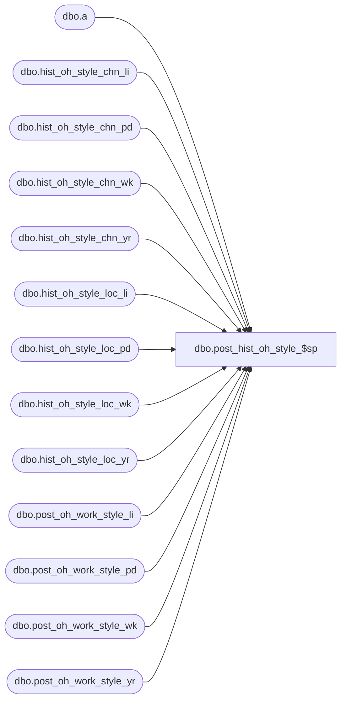

# dbo.post_hist_oh_style_$sp

**Database:** ma_01  
**Server:** bedrockdb02  

## Architecture Diagram



## Table Dependencies

| Referenced Table |
|---|
| dbo.a |
| dbo.hist_oh_style_chn_li |
| dbo.hist_oh_style_chn_pd |
| dbo.hist_oh_style_chn_wk |
| dbo.hist_oh_style_chn_yr |
| dbo.hist_oh_style_loc_li |
| dbo.hist_oh_style_loc_pd |
| dbo.hist_oh_style_loc_wk |
| dbo.hist_oh_style_loc_yr |
| dbo.post_oh_work_style_li |
| dbo.post_oh_work_style_pd |
| dbo.post_oh_work_style_wk |
| dbo.post_oh_work_style_yr |

## Stored Procedure Code

```sql

```

