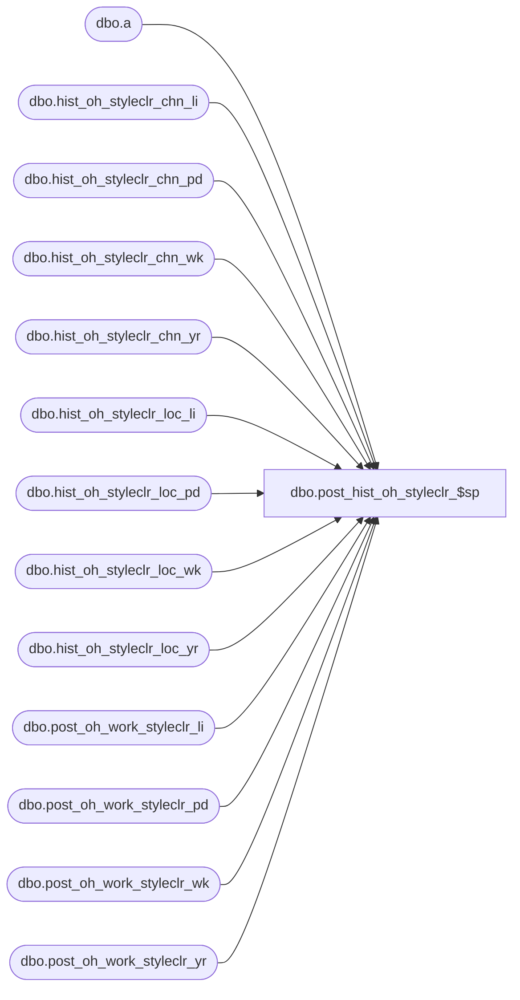

# dbo.post_hist_oh_styleclr_$sp

**Database:** ma_01  
**Server:** bedrockdb02  

## Architecture Diagram



## Table Dependencies

| Referenced Table |
|---|
| dbo.a |
| dbo.hist_oh_styleclr_chn_li |
| dbo.hist_oh_styleclr_chn_pd |
| dbo.hist_oh_styleclr_chn_wk |
| dbo.hist_oh_styleclr_chn_yr |
| dbo.hist_oh_styleclr_loc_li |
| dbo.hist_oh_styleclr_loc_pd |
| dbo.hist_oh_styleclr_loc_wk |
| dbo.hist_oh_styleclr_loc_yr |
| dbo.post_oh_work_styleclr_li |
| dbo.post_oh_work_styleclr_pd |
| dbo.post_oh_work_styleclr_wk |
| dbo.post_oh_work_styleclr_yr |

## Stored Procedure Code

```sql

```

