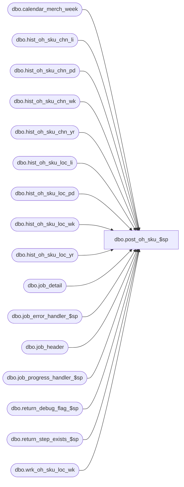

# dbo.post_oh_sku_$sp

**Database:** ma_01  
**Server:** bedrockdb02  

## Architecture Diagram



## Table Dependencies

| Referenced Table |
|---|
| dbo.calendar_merch_week |
| dbo.hist_oh_sku_chn_li |
| dbo.hist_oh_sku_chn_pd |
| dbo.hist_oh_sku_chn_wk |
| dbo.hist_oh_sku_chn_yr |
| dbo.hist_oh_sku_loc_li |
| dbo.hist_oh_sku_loc_pd |
| dbo.hist_oh_sku_loc_wk |
| dbo.hist_oh_sku_loc_yr |
| dbo.job_detail |
| dbo.job_error_handler_$sp |
| dbo.job_header |
| dbo.job_progress_handler_$sp |
| dbo.return_debug_flag_$sp |
| dbo.return_step_exists_$sp |
| dbo.wrk_oh_sku_loc_wk |

## Stored Procedure Code

```sql

```

