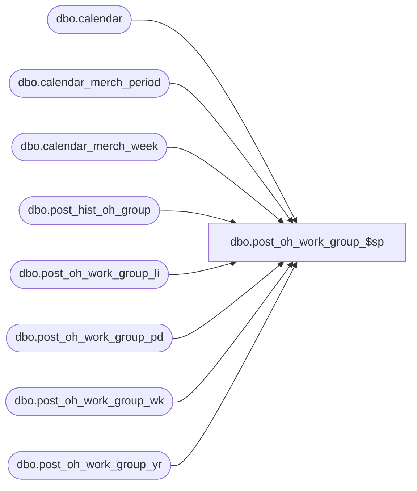

# dbo.post_oh_work_group_$sp

**Database:** ma_01  
**Server:** bedrockdb02  

## Architecture Diagram



## Table Dependencies

| Referenced Table |
|---|
| dbo.calendar |
| dbo.calendar_merch_period |
| dbo.calendar_merch_week |
| dbo.post_hist_oh_group |
| dbo.post_oh_work_group_li |
| dbo.post_oh_work_group_pd |
| dbo.post_oh_work_group_wk |
| dbo.post_oh_work_group_yr |

## Stored Procedure Code

```sql
CREATE PROC [dbo].[post_oh_work_group_$sp]
```

