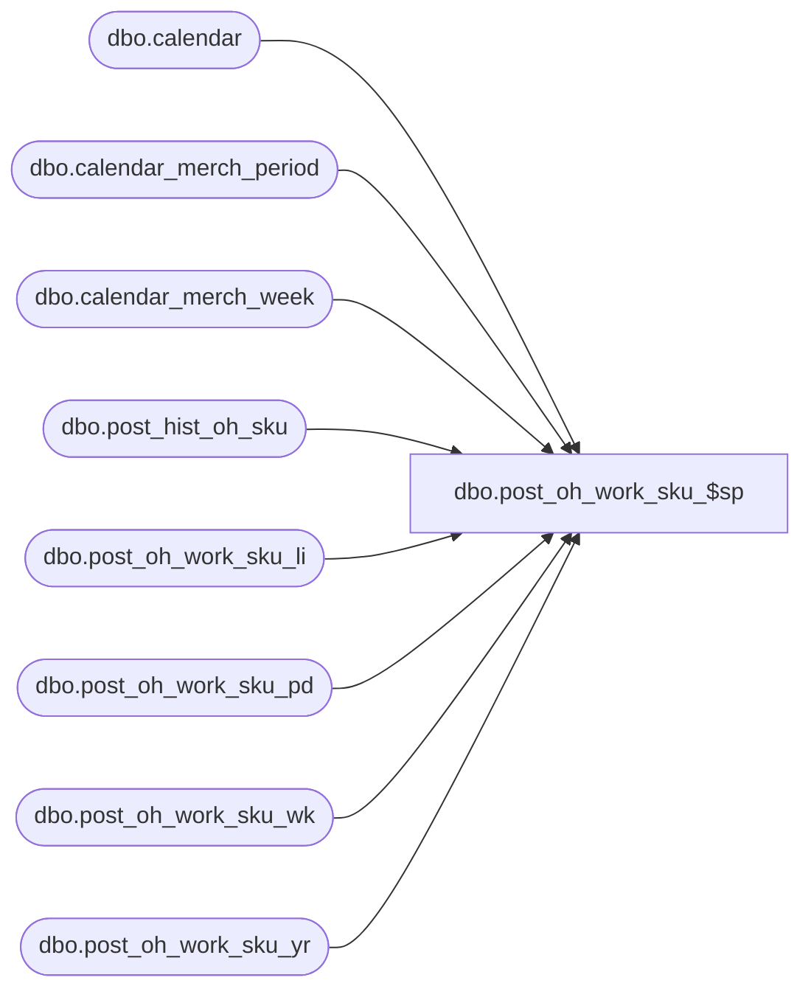

# dbo.post_oh_work_sku_$sp

**Database:** ma_01  
**Server:** bedrockdb02  

## Architecture Diagram



## Table Dependencies

| Referenced Table |
|---|
| dbo.calendar |
| dbo.calendar_merch_period |
| dbo.calendar_merch_week |
| dbo.post_hist_oh_sku |
| dbo.post_oh_work_sku_li |
| dbo.post_oh_work_sku_pd |
| dbo.post_oh_work_sku_wk |
| dbo.post_oh_work_sku_yr |

## Stored Procedure Code

```sql

```

