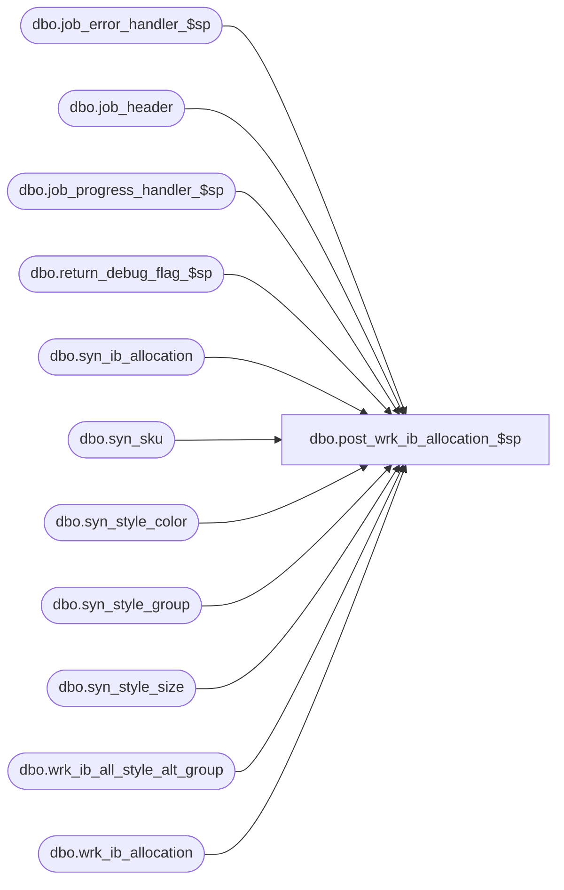

# dbo.post_wrk_ib_allocation_$sp

**Database:** ma_01  
**Server:** bedrockdb02  

## Architecture Diagram



## Table Dependencies

| Referenced Table |
|---|
| dbo.job_error_handler_$sp |
| dbo.job_header |
| dbo.job_progress_handler_$sp |
| dbo.return_debug_flag_$sp |
| dbo.syn_ib_allocation |
| dbo.syn_sku |
| dbo.syn_style_color |
| dbo.syn_style_group |
| dbo.syn_style_size |
| dbo.wrk_ib_all_style_alt_group |
| dbo.wrk_ib_allocation |

## Stored Procedure Code

```sql

```

