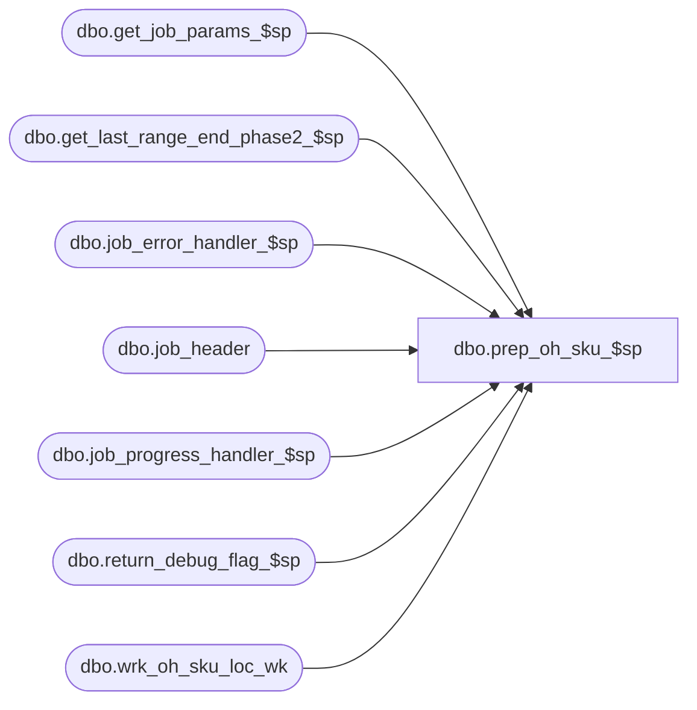

# dbo.prep_oh_sku_$sp

**Database:** ma_01  
**Server:** bedrockdb02  

## Architecture Diagram



## Table Dependencies

| Referenced Table |
|---|
| dbo.get_job_params_$sp |
| dbo.get_last_range_end_phase2_$sp |
| dbo.job_error_handler_$sp |
| dbo.job_header |
| dbo.job_progress_handler_$sp |
| dbo.return_debug_flag_$sp |
| dbo.wrk_oh_sku_loc_wk |

## Stored Procedure Code

```sql

```

