# dbo.prep_roll_oh_$sp

**Database:** ma_01  
**Server:** bedrockdb02  

## Architecture Diagram

```mermaid
flowchart LR
    SP["dbo.prep_roll_oh_$sp"]
    dbo_add_partitions__sp(["dbo.add_partitions_$sp"]) --> SP
    dbo_job_error_handler__sp(["dbo.job_error_handler_$sp"]) --> SP
    dbo_job_progress_handler__sp(["dbo.job_progress_handler_$sp"]) --> SP
    dbo_posting_parameter(["dbo.posting_parameter"]) --> SP
    dbo_prep_roll_oh_color_chn_pd__sp(["dbo.prep_roll_oh_color_chn_pd_$sp"]) --> SP
    dbo_prep_roll_oh_color_chn_wk__sp(["dbo.prep_roll_oh_color_chn_wk_$sp"]) --> SP
    dbo_prep_roll_oh_color_chn_yr__sp(["dbo.prep_roll_oh_color_chn_yr_$sp"]) --> SP
    dbo_prep_roll_oh_color_loc_pd__sp(["dbo.prep_roll_oh_color_loc_pd_$sp"]) --> SP
    dbo_prep_roll_oh_color_loc_wk__sp(["dbo.prep_roll_oh_color_loc_wk_$sp"]) --> SP
    dbo_prep_roll_oh_color_loc_yr__sp(["dbo.prep_roll_oh_color_loc_yr_$sp"]) --> SP
    dbo_prep_roll_oh_group_chn_pd__sp(["dbo.prep_roll_oh_group_chn_pd_$sp"]) --> SP
    dbo_prep_roll_oh_group_chn_wk__sp(["dbo.prep_roll_oh_group_chn_wk_$sp"]) --> SP
    dbo_prep_roll_oh_group_chn_yr__sp(["dbo.prep_roll_oh_group_chn_yr_$sp"]) --> SP
    dbo_prep_roll_oh_group_loc_pd__sp(["dbo.prep_roll_oh_group_loc_pd_$sp"]) --> SP
    dbo_prep_roll_oh_group_loc_wk__sp(["dbo.prep_roll_oh_group_loc_wk_$sp"]) --> SP
    dbo_prep_roll_oh_group_loc_yr__sp(["dbo.prep_roll_oh_group_loc_yr_$sp"]) --> SP
    dbo_prep_roll_oh_sku_chn_pd__sp(["dbo.prep_roll_oh_sku_chn_pd_$sp"]) --> SP
    dbo_prep_roll_oh_sku_chn_wk__sp(["dbo.prep_roll_oh_sku_chn_wk_$sp"]) --> SP
    dbo_prep_roll_oh_sku_chn_yr__sp(["dbo.prep_roll_oh_sku_chn_yr_$sp"]) --> SP
    dbo_prep_roll_oh_sku_loc_pd__sp(["dbo.prep_roll_oh_sku_loc_pd_$sp"]) --> SP
    dbo_prep_roll_oh_sku_loc_wk__sp(["dbo.prep_roll_oh_sku_loc_wk_$sp"]) --> SP
    dbo_prep_roll_oh_sku_loc_yr__sp(["dbo.prep_roll_oh_sku_loc_yr_$sp"]) --> SP
    dbo_prep_roll_oh_style_chn_pd__sp(["dbo.prep_roll_oh_style_chn_pd_$sp"]) --> SP
    dbo_prep_roll_oh_style_chn_wk__sp(["dbo.prep_roll_oh_style_chn_wk_$sp"]) --> SP
    dbo_prep_roll_oh_style_chn_yr__sp(["dbo.prep_roll_oh_style_chn_yr_$sp"]) --> SP
    dbo_prep_roll_oh_style_loc_pd__sp(["dbo.prep_roll_oh_style_loc_pd_$sp"]) --> SP
    dbo_prep_roll_oh_style_loc_wk__sp(["dbo.prep_roll_oh_style_loc_wk_$sp"]) --> SP
    dbo_prep_roll_oh_style_loc_yr__sp(["dbo.prep_roll_oh_style_loc_yr_$sp"]) --> SP
    dbo_return_debug_flag__sp(["dbo.return_debug_flag_$sp"]) --> SP
```



## Table Dependencies

| Referenced Table |
|---|
| dbo.add_partitions_$sp |
| dbo.job_error_handler_$sp |
| dbo.job_progress_handler_$sp |
| dbo.posting_parameter |
| dbo.prep_roll_oh_color_chn_pd_$sp |
| dbo.prep_roll_oh_color_chn_wk_$sp |
| dbo.prep_roll_oh_color_chn_yr_$sp |
| dbo.prep_roll_oh_color_loc_pd_$sp |
| dbo.prep_roll_oh_color_loc_wk_$sp |
| dbo.prep_roll_oh_color_loc_yr_$sp |
| dbo.prep_roll_oh_group_chn_pd_$sp |
| dbo.prep_roll_oh_group_chn_wk_$sp |
| dbo.prep_roll_oh_group_chn_yr_$sp |
| dbo.prep_roll_oh_group_loc_pd_$sp |
| dbo.prep_roll_oh_group_loc_wk_$sp |
| dbo.prep_roll_oh_group_loc_yr_$sp |
| dbo.prep_roll_oh_sku_chn_pd_$sp |
| dbo.prep_roll_oh_sku_chn_wk_$sp |
| dbo.prep_roll_oh_sku_chn_yr_$sp |
| dbo.prep_roll_oh_sku_loc_pd_$sp |
| dbo.prep_roll_oh_sku_loc_wk_$sp |
| dbo.prep_roll_oh_sku_loc_yr_$sp |
| dbo.prep_roll_oh_style_chn_pd_$sp |
| dbo.prep_roll_oh_style_chn_wk_$sp |
| dbo.prep_roll_oh_style_chn_yr_$sp |
| dbo.prep_roll_oh_style_loc_pd_$sp |
| dbo.prep_roll_oh_style_loc_wk_$sp |
| dbo.prep_roll_oh_style_loc_yr_$sp |
| dbo.return_debug_flag_$sp |

## Stored Procedure Code

```sql

```

