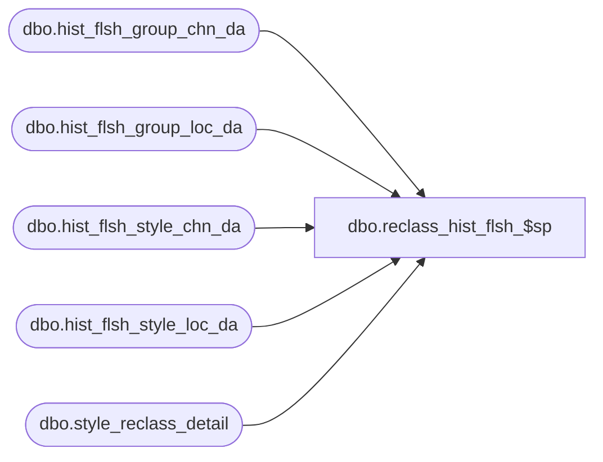

# dbo.reclass_hist_flsh_$sp

**Database:** ma_01  
**Server:** bedrockdb02  

## Architecture Diagram



## Table Dependencies

| Referenced Table |
|---|
| dbo.hist_flsh_group_chn_da |
| dbo.hist_flsh_group_loc_da |
| dbo.hist_flsh_style_chn_da |
| dbo.hist_flsh_style_loc_da |
| dbo.style_reclass_detail |

## Stored Procedure Code

```sql

```

