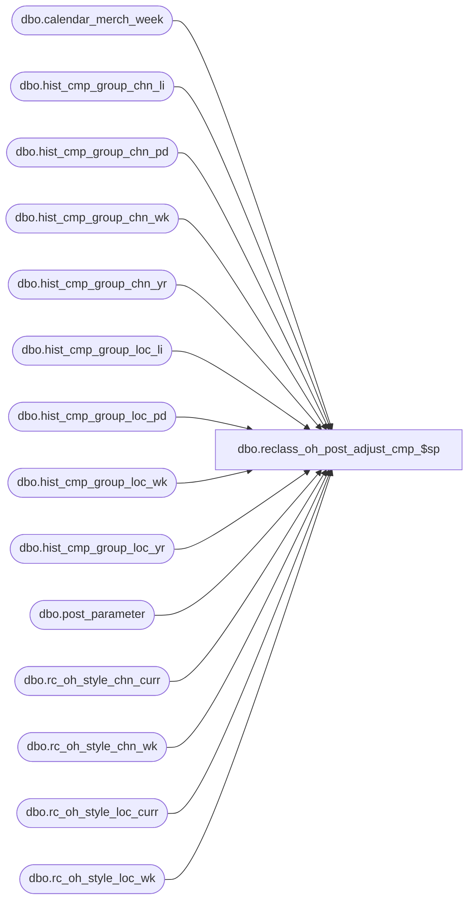

# dbo.reclass_oh_post_adjust_cmp_$sp

**Database:** ma_01  
**Server:** bedrockdb02  

## Architecture Diagram



## Table Dependencies

| Referenced Table |
|---|
| dbo.calendar_merch_week |
| dbo.hist_cmp_group_chn_li |
| dbo.hist_cmp_group_chn_pd |
| dbo.hist_cmp_group_chn_wk |
| dbo.hist_cmp_group_chn_yr |
| dbo.hist_cmp_group_loc_li |
| dbo.hist_cmp_group_loc_pd |
| dbo.hist_cmp_group_loc_wk |
| dbo.hist_cmp_group_loc_yr |
| dbo.post_parameter |
| dbo.rc_oh_style_chn_curr |
| dbo.rc_oh_style_chn_wk |
| dbo.rc_oh_style_loc_curr |
| dbo.rc_oh_style_loc_wk |

## Stored Procedure Code

```sql

```

