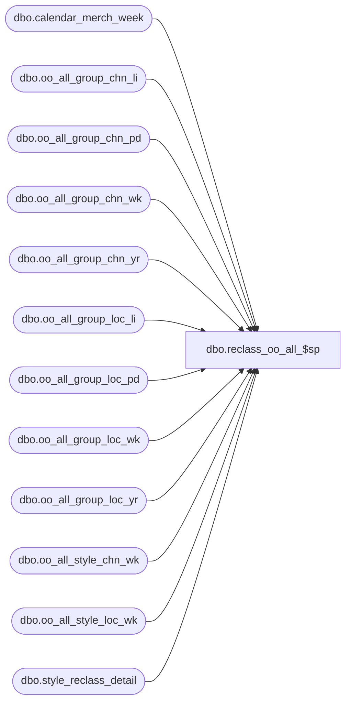

# dbo.reclass_oo_all_$sp

**Database:** ma_01  
**Server:** bedrockdb02  

## Architecture Diagram



## Table Dependencies

| Referenced Table |
|---|
| dbo.calendar_merch_week |
| dbo.oo_all_group_chn_li |
| dbo.oo_all_group_chn_pd |
| dbo.oo_all_group_chn_wk |
| dbo.oo_all_group_chn_yr |
| dbo.oo_all_group_loc_li |
| dbo.oo_all_group_loc_pd |
| dbo.oo_all_group_loc_wk |
| dbo.oo_all_group_loc_yr |
| dbo.oo_all_style_chn_wk |
| dbo.oo_all_style_loc_wk |
| dbo.style_reclass_detail |

## Stored Procedure Code

```sql

```

