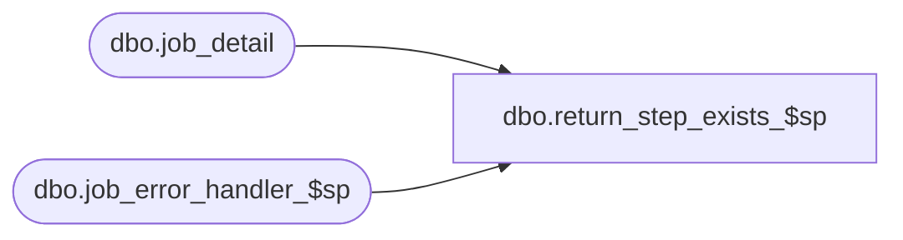

# dbo.return_step_exists_$sp

**Database:** ma_01  
**Server:** bedrockdb02  

## Architecture Diagram



## Table Dependencies

| Referenced Table |
|---|
| dbo.job_detail |
| dbo.job_error_handler_$sp |

## Stored Procedure Code

```sql
create proc [dbo].[return_step_exists_$sp]
```

