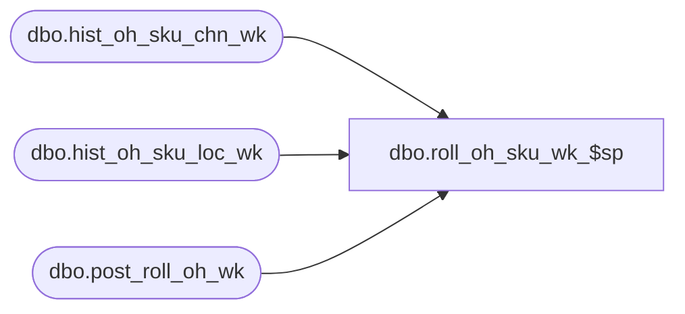

# dbo.roll_oh_sku_wk_$sp

**Database:** ma_01  
**Server:** bedrockdb02  

## Architecture Diagram



## Table Dependencies

| Referenced Table |
|---|
| dbo.hist_oh_sku_chn_wk |
| dbo.hist_oh_sku_loc_wk |
| dbo.post_roll_oh_wk |

## Stored Procedure Code

```sql

```

