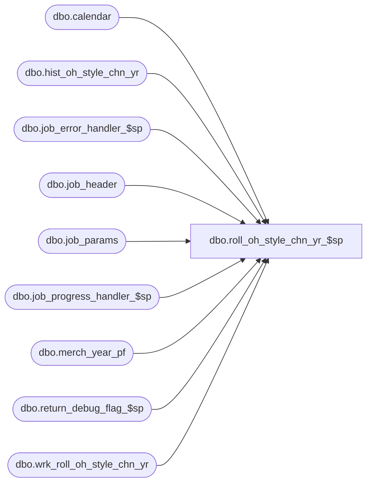

# dbo.roll_oh_style_chn_yr_$sp

**Database:** ma_01  
**Server:** bedrockdb02  

## Architecture Diagram



## Table Dependencies

| Referenced Table |
|---|
| dbo.calendar |
| dbo.hist_oh_style_chn_yr |
| dbo.job_error_handler_$sp |
| dbo.job_header |
| dbo.job_params |
| dbo.job_progress_handler_$sp |
| dbo.merch_year_pf |
| dbo.return_debug_flag_$sp |
| dbo.wrk_roll_oh_style_chn_yr |

## Stored Procedure Code

```sql

```

