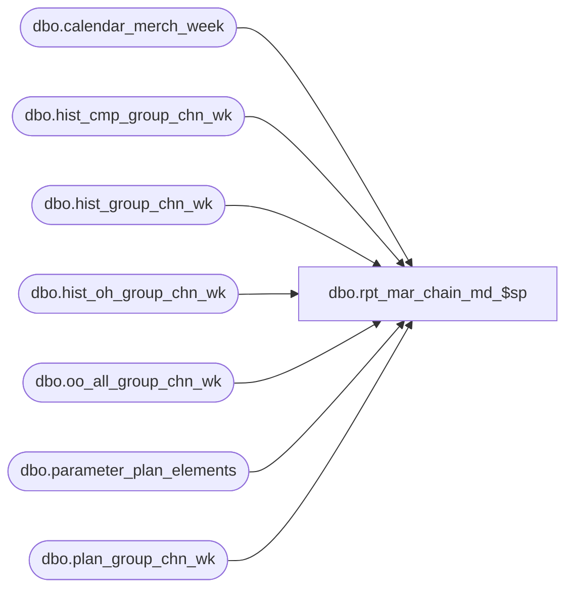

# dbo.rpt_mar_chain_md_$sp

**Database:** ma_01  
**Server:** bedrockdb02  

## Architecture Diagram



## Table Dependencies

| Referenced Table |
|---|
| dbo.calendar_merch_week |
| dbo.hist_cmp_group_chn_wk |
| dbo.hist_group_chn_wk |
| dbo.hist_oh_group_chn_wk |
| dbo.oo_all_group_chn_wk |
| dbo.parameter_plan_elements |
| dbo.plan_group_chn_wk |

## Stored Procedure Code

```sql

```

