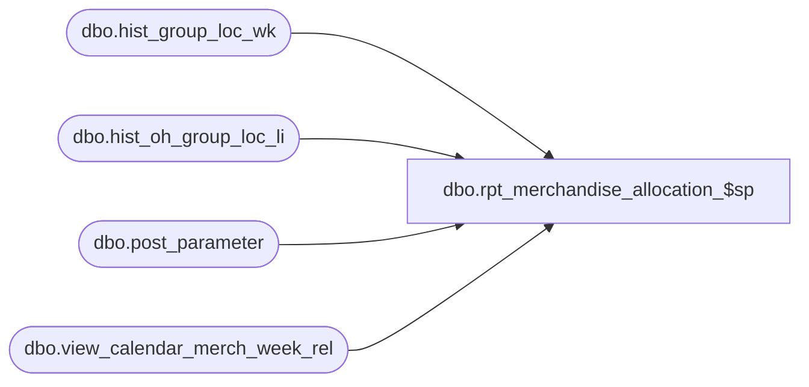

# dbo.rpt_merchandise_allocation_$sp

**Database:** ma_01  
**Server:** bedrockdb02  

## Architecture Diagram



## Table Dependencies

| Referenced Table |
|---|
| dbo.hist_group_loc_wk |
| dbo.hist_oh_group_loc_li |
| dbo.post_parameter |
| dbo.view_calendar_merch_week_rel |

## Stored Procedure Code

```sql

```

