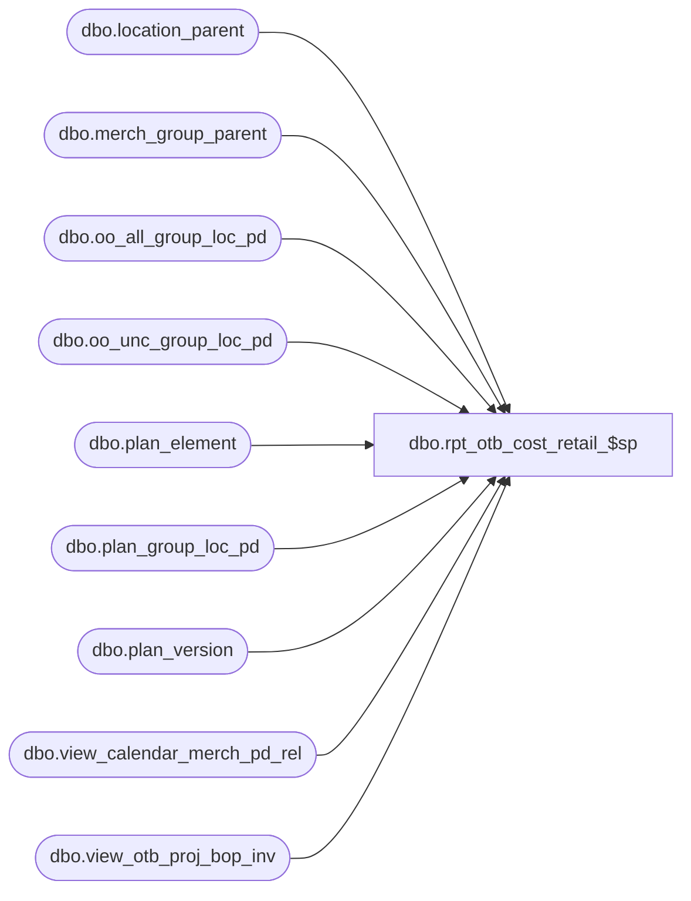

# dbo.rpt_otb_cost_retail_$sp

**Database:** ma_01  
**Server:** bedrockdb02  

## Architecture Diagram



## Table Dependencies

| Referenced Table |
|---|
| dbo.location_parent |
| dbo.merch_group_parent |
| dbo.oo_all_group_loc_pd |
| dbo.oo_unc_group_loc_pd |
| dbo.plan_element |
| dbo.plan_group_loc_pd |
| dbo.plan_version |
| dbo.view_calendar_merch_pd_rel |
| dbo.view_otb_proj_bop_inv |

## Stored Procedure Code

```sql

```

