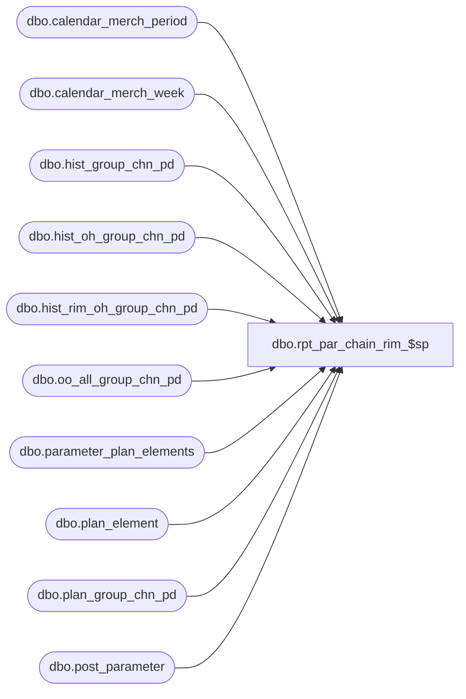

# dbo.rpt_par_chain_rim_$sp

**Database:** ma_01  
**Server:** bedrockdb02  

## Architecture Diagram



## Table Dependencies

| Referenced Table |
|---|
| dbo.calendar_merch_period |
| dbo.calendar_merch_week |
| dbo.hist_group_chn_pd |
| dbo.hist_oh_group_chn_pd |
| dbo.hist_rim_oh_group_chn_pd |
| dbo.oo_all_group_chn_pd |
| dbo.parameter_plan_elements |
| dbo.plan_element |
| dbo.plan_group_chn_pd |
| dbo.post_parameter |

## Stored Procedure Code

```sql

```

