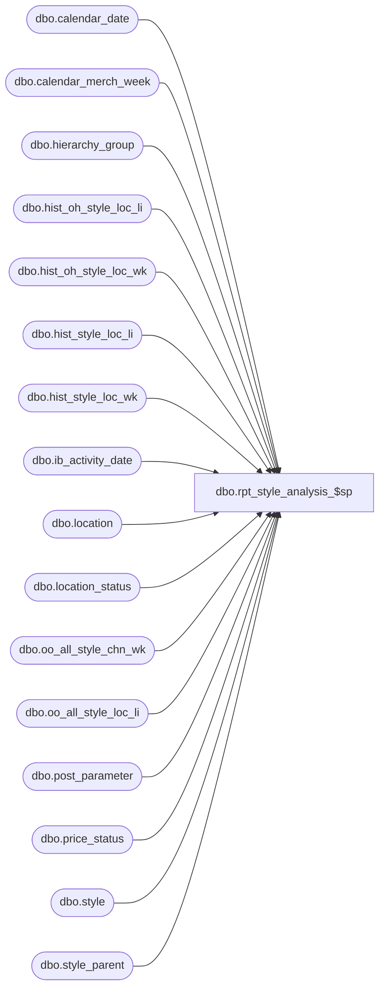

# dbo.rpt_style_analysis_$sp

**Database:** ma_01  
**Server:** bedrockdb02  

## Architecture Diagram



## Table Dependencies

| Referenced Table |
|---|
| dbo.calendar_date |
| dbo.calendar_merch_week |
| dbo.hierarchy_group |
| dbo.hist_oh_style_loc_li |
| dbo.hist_oh_style_loc_wk |
| dbo.hist_style_loc_li |
| dbo.hist_style_loc_wk |
| dbo.ib_activity_date |
| dbo.location |
| dbo.location_status |
| dbo.oo_all_style_chn_wk |
| dbo.oo_all_style_loc_li |
| dbo.post_parameter |
| dbo.price_status |
| dbo.style |
| dbo.style_parent |

## Stored Procedure Code

```sql

```

