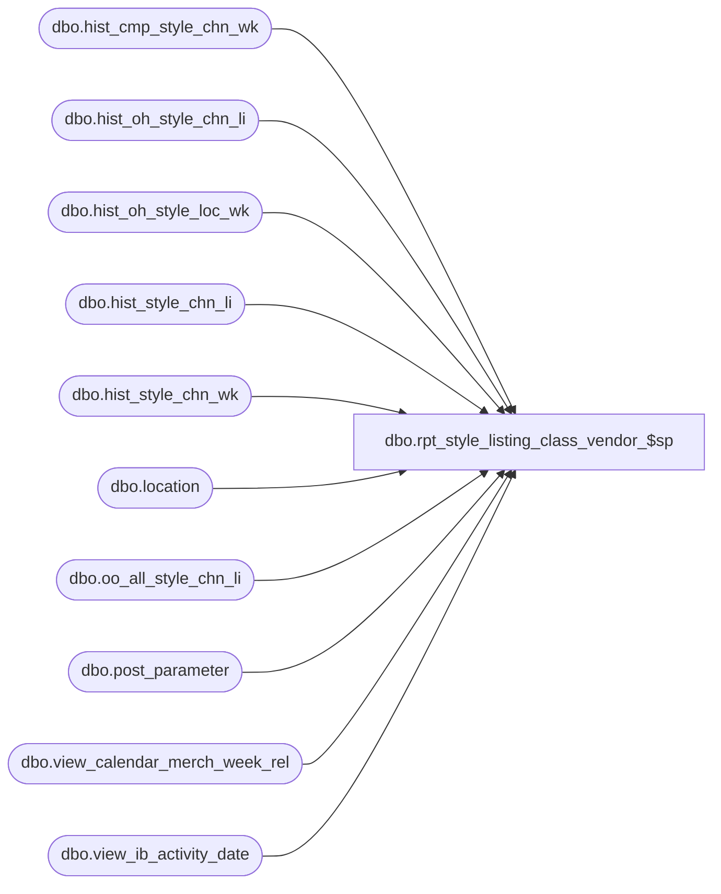

# dbo.rpt_style_listing_class_vendor_$sp

**Database:** ma_01  
**Server:** bedrockdb02  

## Architecture Diagram



## Table Dependencies

| Referenced Table |
|---|
| dbo.hist_cmp_style_chn_wk |
| dbo.hist_oh_style_chn_li |
| dbo.hist_oh_style_loc_wk |
| dbo.hist_style_chn_li |
| dbo.hist_style_chn_wk |
| dbo.location |
| dbo.oo_all_style_chn_li |
| dbo.post_parameter |
| dbo.view_calendar_merch_week_rel |
| dbo.view_ib_activity_date |

## Stored Procedure Code

```sql

```

