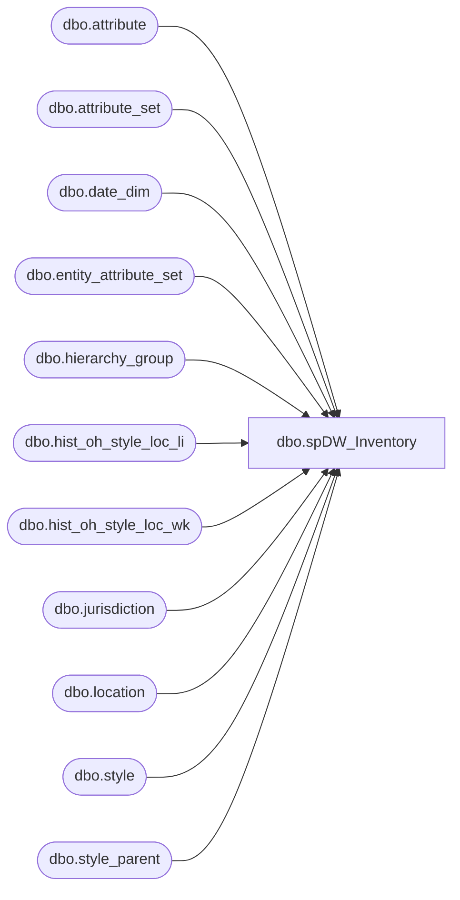

# dbo.spDW_Inventory

**Database:** ma_01  
**Server:** bedrockdb02  

## Architecture Diagram



## Table Dependencies

| Referenced Table |
|---|
| dbo.attribute |
| dbo.attribute_set |
| dbo.date_dim |
| dbo.entity_attribute_set |
| dbo.hierarchy_group |
| dbo.hist_oh_style_loc_li |
| dbo.hist_oh_style_loc_wk |
| dbo.jurisdiction |
| dbo.location |
| dbo.style |
| dbo.style_parent |

## Stored Procedure Code

```sql
CREATE proc [dbo].[spDW_Inventory]
```

