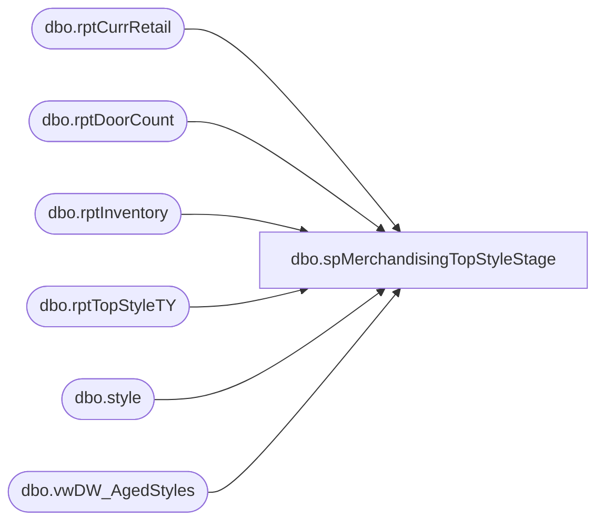

# dbo.spMerchandisingTopStyleStage

**Database:** ma_01  
**Server:** bedrockdb02  

## Architecture Diagram



## Table Dependencies

| Referenced Table |
|---|
| dbo.rptCurrRetail |
| dbo.rptDoorCount |
| dbo.rptInventory |
| dbo.rptTopStyleTY |
| dbo.style |
| dbo.vwDW_AgedStyles |

## Stored Procedure Code

```sql

```

