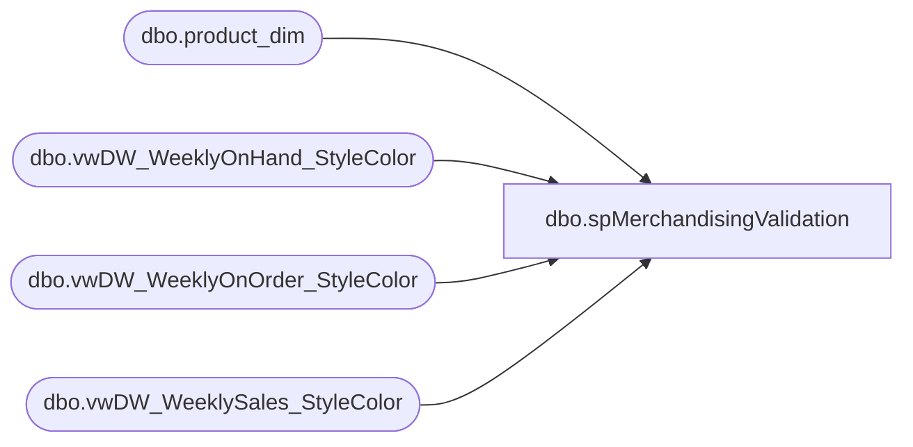

# dbo.spMerchandisingValidation

**Database:** ma_01  
**Server:** bedrockdb02  

## Architecture Diagram



## Table Dependencies

| Referenced Table |
|---|
| dbo.product_dim |
| dbo.vwDW_WeeklyOnHand_StyleColor |
| dbo.vwDW_WeeklyOnOrder_StyleColor |
| dbo.vwDW_WeeklySales_StyleColor |

## Stored Procedure Code

```sql
-- =============================================
```

