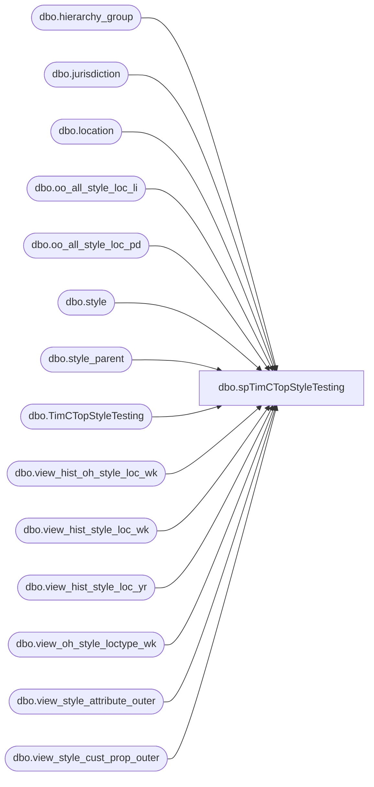

# dbo.spTimCTopStyleTesting

**Database:** ma_01  
**Server:** bedrockdb02  

## Architecture Diagram



## Table Dependencies

| Referenced Table |
|---|
| dbo.hierarchy_group |
| dbo.jurisdiction |
| dbo.location |
| dbo.oo_all_style_loc_li |
| dbo.oo_all_style_loc_pd |
| dbo.style |
| dbo.style_parent |
| dbo.TimCTopStyleTesting |
| dbo.view_hist_oh_style_loc_wk |
| dbo.view_hist_style_loc_wk |
| dbo.view_hist_style_loc_yr |
| dbo.view_oh_style_loctype_wk |
| dbo.view_style_attribute_outer |
| dbo.view_style_cust_prop_outer |

## Stored Procedure Code

```sql

```

