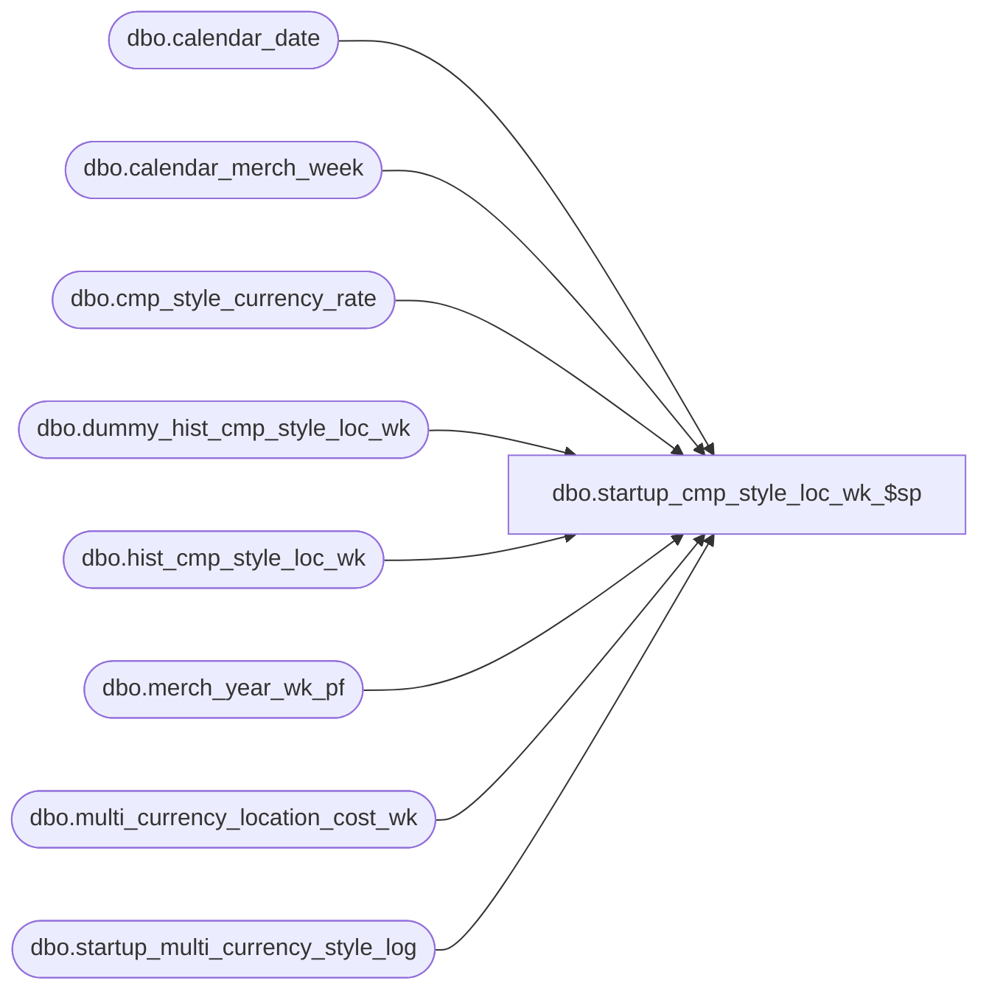

# dbo.startup_cmp_style_loc_wk_$sp

**Database:** ma_01  
**Server:** bedrockdb02  

## Architecture Diagram



## Table Dependencies

| Referenced Table |
|---|
| dbo.calendar_date |
| dbo.calendar_merch_week |
| dbo.cmp_style_currency_rate |
| dbo.dummy_hist_cmp_style_loc_wk |
| dbo.hist_cmp_style_loc_wk |
| dbo.merch_year_wk_pf |
| dbo.multi_currency_location_cost_wk |
| dbo.startup_multi_currency_style_log |

## Stored Procedure Code

```sql

```

