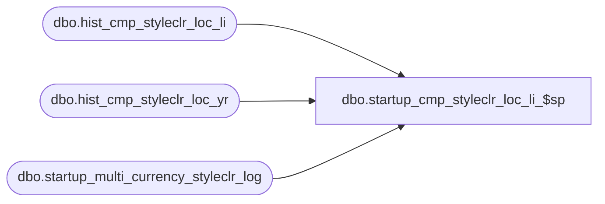

# dbo.startup_cmp_styleclr_loc_li_$sp

**Database:** ma_01  
**Server:** bedrockdb02  

## Architecture Diagram



## Table Dependencies

| Referenced Table |
|---|
| dbo.hist_cmp_styleclr_loc_li |
| dbo.hist_cmp_styleclr_loc_yr |
| dbo.startup_multi_currency_styleclr_log |

## Stored Procedure Code

```sql

```

