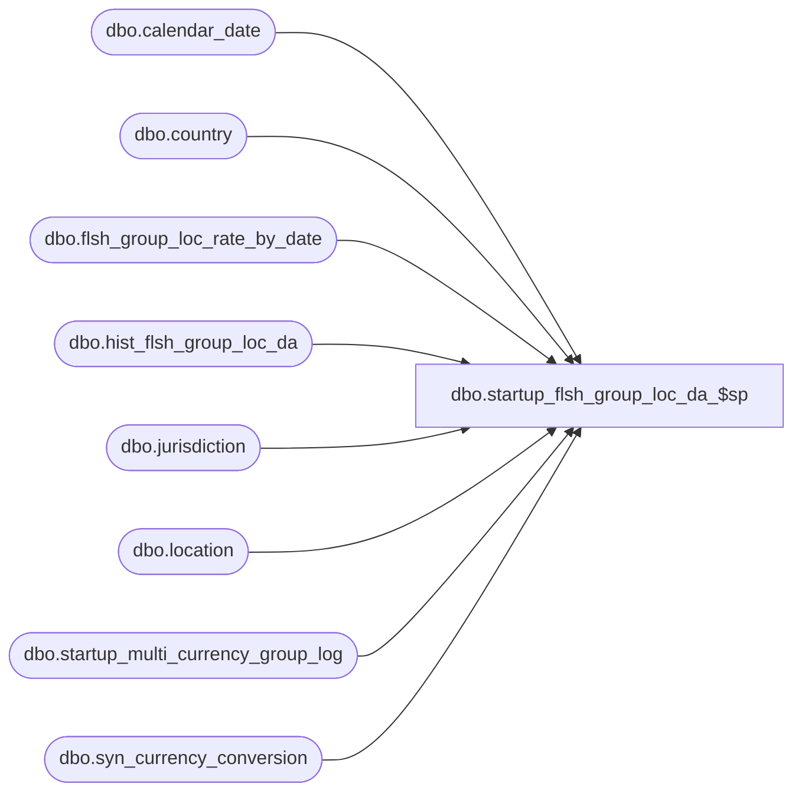

# dbo.startup_flsh_group_loc_da_$sp

**Database:** ma_01  
**Server:** bedrockdb02  

## Architecture Diagram



## Table Dependencies

| Referenced Table |
|---|
| dbo.calendar_date |
| dbo.country |
| dbo.flsh_group_loc_rate_by_date |
| dbo.hist_flsh_group_loc_da |
| dbo.jurisdiction |
| dbo.location |
| dbo.startup_multi_currency_group_log |
| dbo.syn_currency_conversion |

## Stored Procedure Code

```sql

```

