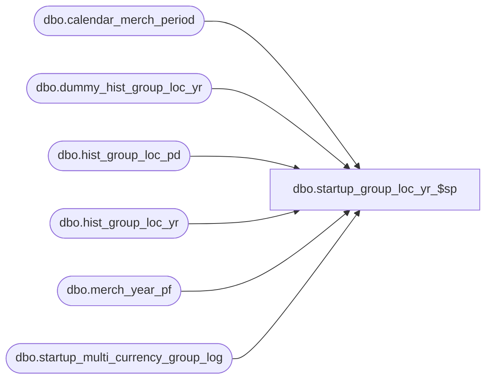

# dbo.startup_group_loc_yr_$sp

**Database:** ma_01  
**Server:** bedrockdb02  

## Architecture Diagram



## Table Dependencies

| Referenced Table |
|---|
| dbo.calendar_merch_period |
| dbo.dummy_hist_group_loc_yr |
| dbo.hist_group_loc_pd |
| dbo.hist_group_loc_yr |
| dbo.merch_year_pf |
| dbo.startup_multi_currency_group_log |

## Stored Procedure Code

```sql

```

