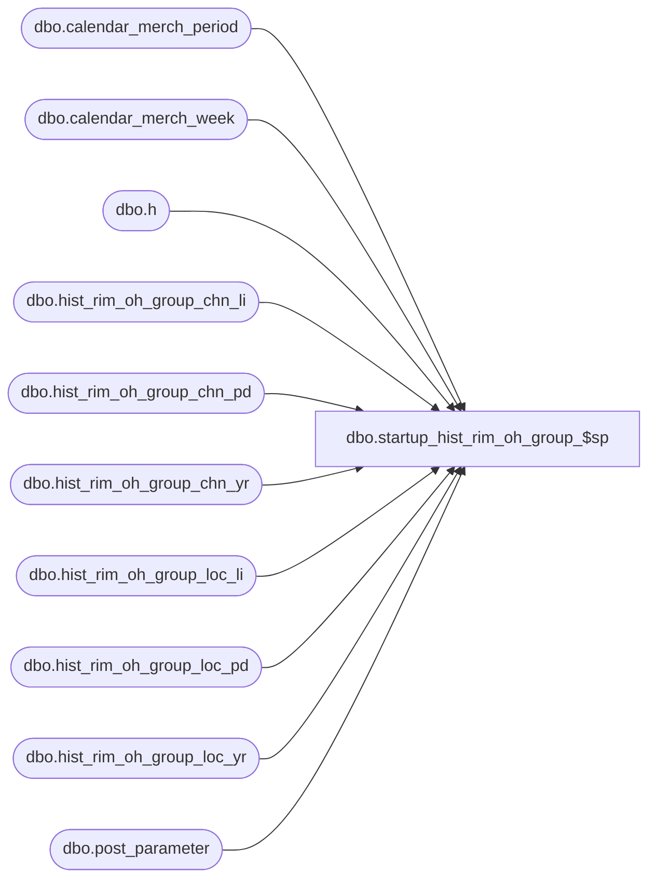

# dbo.startup_hist_rim_oh_group_$sp

**Database:** ma_01  
**Server:** bedrockdb02  

## Architecture Diagram



## Table Dependencies

| Referenced Table |
|---|
| dbo.calendar_merch_period |
| dbo.calendar_merch_week |
| dbo.h |
| dbo.hist_rim_oh_group_chn_li |
| dbo.hist_rim_oh_group_chn_pd |
| dbo.hist_rim_oh_group_chn_yr |
| dbo.hist_rim_oh_group_loc_li |
| dbo.hist_rim_oh_group_loc_pd |
| dbo.hist_rim_oh_group_loc_yr |
| dbo.post_parameter |

## Stored Procedure Code

```sql

```

